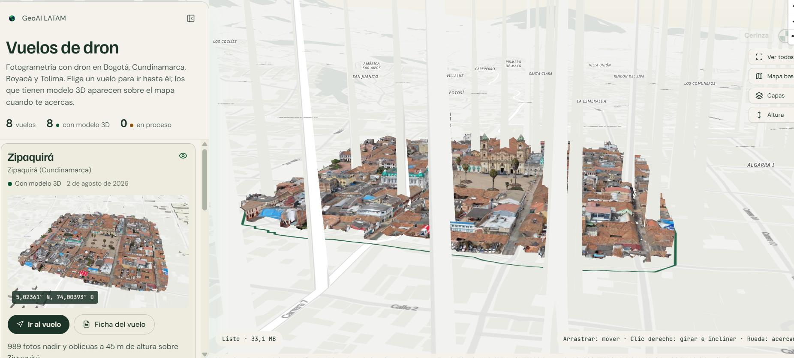
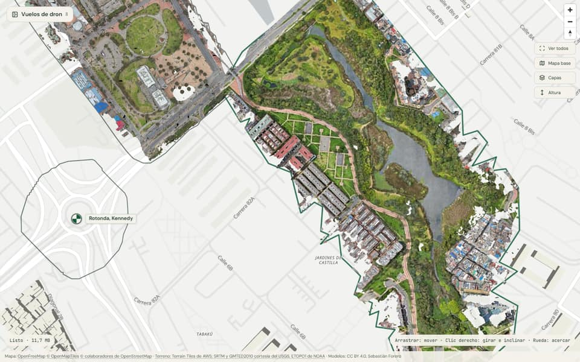
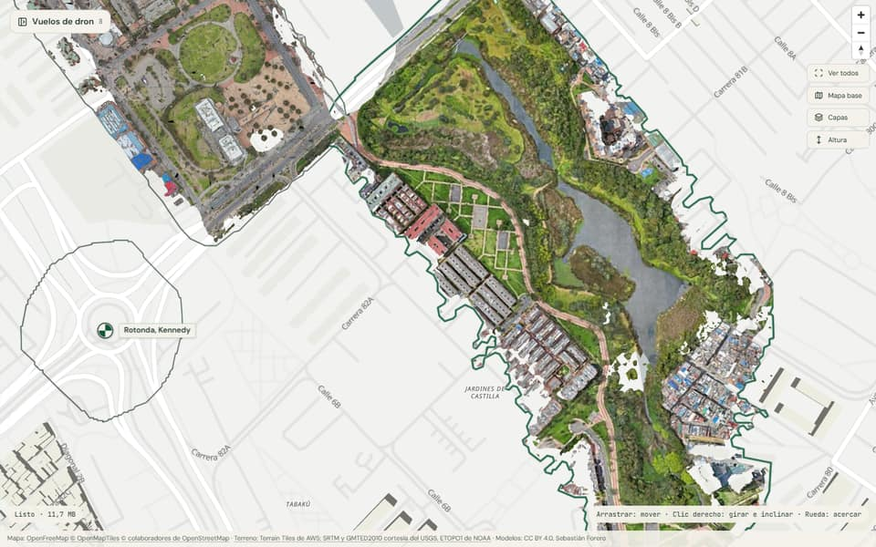
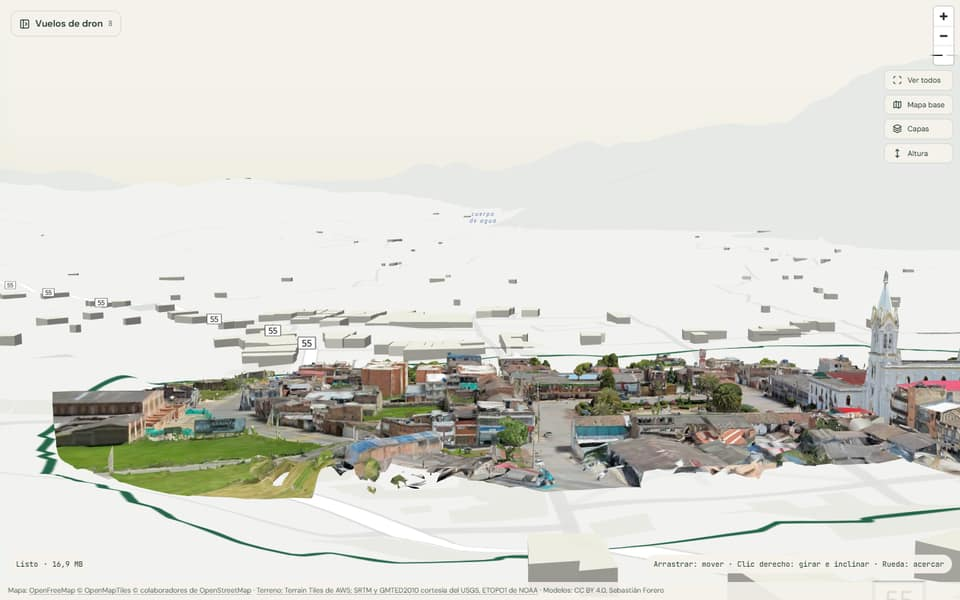
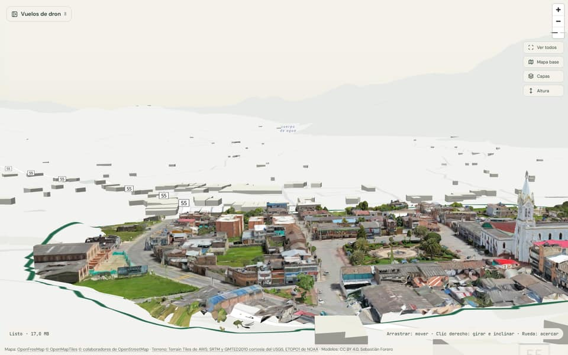
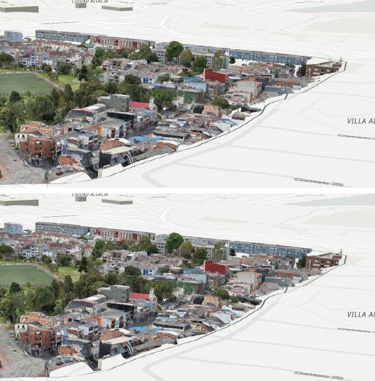

# Galería de vuelos: lo pendiente

Lista viva de lo que falta en la galería. Abierta el 25-sep-2026, cuando el
explorador todavía vivía dentro del sitio de GeoAI LATAM; sigue acá desde que la
galería es su propio repo. Se tacha lo que se cierra, no se borra.

## Errores visibles

### ~~1. Columnas del terreno que tapan la malla~~
**Resuelto el 25-sep-2026:** Brave altera al azar el bit bajo de algunos píxeles al leer un canvas (contra la huella digital), y en R eso son 256 m; el hundimiento ya no pasa por un lienzo, lee y escribe el PNG con fflate.

- **Qué se ve:** en Zipaquirá, el terreno levanta columnas verticales que llegan
  casi al cielo, tapan tramos de la malla y la dejan en franjas. Reportado por
  Sebastián el 25-sep-2026 a las 5:04.
- **Sospecha principal:** el `addProtocol` que vuelve a codificar las teselas
  Terrarium para hundir el terreno bajo la huella. Si al volver a codificar,
  `(R*256+G+B/256)-32768` se sale de rango en algún pixel (valor negativo o por
  encima de 65535 en R*256+G), ese pixel sale a miles de metros y forma una columna.
- **Otras causas posibles:** las faldas de borde de las teselas de terreno
  (`TerrariumMeshPlugin` o el raster-dem de MapLibre) combinadas con la rampa del
  hundimiento, o pixeles sin dato de SRTM.
- **Para verificar:** apagar "Hundimiento bajo la huella" en Capas y ver si
  desaparecen. Si desaparecen, el error está en el recodificado: acotar el valor
  (clamp) antes de escribir R, G y B, y revisar la rampa en los bordes de tesela.

### ~~2. La huella del Humedal El Burro es más grande que la malla~~
**Resuelto el 25-sep-2026:** `huella_tileset.mjs` marca la grilla con los triángulos que no son pared (vistos desde arriba) y no deja que Douglas-Peucker pase de 3 m; antes llegaba a 14,5 m en el Humedal y el polígono se salía 20-60 m al oeste. Se rehicieron las ocho huellas. En D: quedan las dos versiones anteriores (`huella_tileset.v1.mjs.bak`, `huella_tileset.v2-vertices.mjs.bak`). Queda el punto 18.

| Antes | Después |
| --- | --- |
|  |  |

- En los bordes sur y oeste no hay geometría, pero el terreno se hunde y el mapa
  no dibuja edificios ahí, así que se ve como un vacío.
- **Arreglo:** ajustar `huella_tileset.mjs` (hoy en `tuberia/`) para que siga
  la malla real y no el contorno que marcan los fragmentos del borde. Revisar las
  huellas de los otros 7 vuelos con el mismo criterio.

### ~~3. Parque y Cerinza están inclinados contra el terreno~~
**Resuelto el 25-sep-2026:** `escena.inclinacion` en el JSON del vuelo gira el modelo en la escena, sin rehacer teselas (no hay nada que subir a R2). Medido en el borde de cada malla, estaban ladeados cinco más de los dos: Virgilio Barco 33 m/km, Cerinza 68, Ibagué 26, Castilla 24, Zipaquirá 14 y el Humedal 10; enderezados quedan por debajo de 5 m/km. En el mismo commit, los siete vuelos de SLPK bajan entre 0,5 y 4,7 m: su ajuste salía del suelo abierto de adentro y flotaban (ver punto 20).

| Antes | Después |
| --- | --- |
|  |  |

- Parque: 36 m/km (sube hacia el NNE, unos 23 m de desnivel). Cerinza: 60 m/km
  (sube hacia el OSO, unos 21 m).
- El ajuste de altura es una sola constante y no lo corrige. **Arreglo:** aplicar
  la rotación de inclinación que ya usa `georref-tileset.mjs` con el Tintal.

### ~~22. Los modelos se hundían en el borde~~
**Resuelto el 25-sep-2026:** la escena sube todos los modelos 1,5 m (`MARGEN_SUELO_M` en `data/escena.js`) encima de su ajuste; el cuartil bajo del borde pasa de negativo a cerca de 0 en la Rotonda, la Virgilio Barco, Cerinza y Castilla, y Zipaquirá deja de hundir sus calles del borde. El Tintal y el Humedal siguen con parte del borde bajo el terreno: su borde se reparte en unos 10 m contra SRTM y subirlos más los haría flotar del otro lado. Detalle en `content/vuelos/README.md`, "El margen sobre el terreno".

## Rendimiento

### 4. Worker delante de R2 (decisión pendiente)
- Listo y probado en `tuberia/worker-vuelos/` (8 pruebas pasan). No está
  desplegado: es un cambio en la cuenta de Cloudflare y lo aprueba Sebastián.
- Gana sobre todo por HTTP/2: r2.dev contesta en HTTP/1.1 (6 descargas a la vez).
  Estimado: unos 28 % menos de espera al acercarse en el Humedal y en Zipaquirá.
- La caché de borde solo sirve con un dominio en Cloudflare, e `inspow.tech` está
  en Route 53 (AWS).
- Deploy: `cd tuberia/worker-vuelos && npx wrangler@4 deploy`. Después se
  cambia `TILES_BASE` en `data/escena.js`.

### ~~5. El Tintal pesa más que los demás~~
**Resuelto el 26-sep-2026:** se rehízo desde su SLPK
(`TintalCompletoOblicuasNadirPerimetral-3D_Mesh_SLPK.slpk`, 10,5 GB) con
`slpk_a_tiles.mjs`, por el mismo camino que los otros siete, y está en R2 como
`tintal/v2/geo`. Nueve niveles de detalle del propio SLPK, hojas con el JPEG
original (texel de 0,9 cm) y los niveles intermedios en KTX2. En total pesa más
(4.148 MB y 19.943 archivos, contra 442 MB del v1), pero se baja por partes: la
primera vista del modelo pasa de 7,9 a 0,59 MB, elegirlo en el explorador baja
17 MB (antes 22) y la caché de teselas en esa vista, con el Humedal y la
Rotonda también vivos, pasa de 112 a 28 MB. La huella se
rehízo con la versión actual de `huella_tileset.mjs`, y el modelo lleva
`escena.inclinacion` (subía 32 m/km hacia el noroeste) y `ajuste_altura_m`
`-67.79`, medido en el borde. Sale sin visor propio en la ficha, como los otros
siete. `tintal/v1/` (`geo` y `local`, 842 MB en 685 archivos) se borró de R2 el
26-sep-2026, con `rclone purge`, después de comprobar que ningún repo lo usaba.

- 480 MB con texturas JPEG de 1276x4096. Su límite es el peso, no la red.
- **Arreglo:** texturas a KTX2 en las hojas, o teselas más chicas, o rehacerlo
  desde su SLPK con `slpk_a_tiles.mjs` si existe uno.

### 6. r2.dev no es para producción
- Cloudflare lo limita y lo recomienda solo para desarrollo. Pasar al Worker (punto 4)
  o a un dominio propio en Cloudflare antes de tener tráfico real.

## Detalles de interfaz

7. ~~**CORS de R2** solo acepta `geoai-latam.inspow.tech` y localhost: en las
   previews de Vercel (`*.vercel.app`) el modelo no carga.~~
   **Resuelto el 25-sep-2026:** la regla acepta `https://galeria-vuelos.vercel.app`
   (ver el punto 21). Las vistas previas de cada rama siguen fuera: si hacen
   falta, se agregan a mano o se abre la regla a cualquier origen.
8. ~~**"0 en proceso"** en el resumen del panel: ocultar el contador cuando es cero.~~
   **Resuelto el 25-sep-2026.**
9. ~~**Atribución en el teléfono** ocupa tres renglones encima de la hoja: compactarla.~~
   **Resuelto el 25-sep-2026:** un renglón con los nombres cortos y "Créditos" para el texto completo.
10. ~~**Parpadeo del terreno** al prender o apagar una capa de vuelo, porque se quita
    y se vuelve a poner el terreno.~~
    **Resuelto el 25-sep-2026:** la fuente con el nuevo hundimiento baja al lado y el terreno cambia a ella sin pasar por null (0 cuadros sin terreno, en Chromium y en Brave).
11. ~~La miniatura del **Humedal El Burro** quedó con el modelo pequeño en el cuadro.~~
    **Resuelto el 25-sep-2026** (y la causa de fondo: con la vista chica el modelo ni se dibujaba).

18. **Huecos adentro de la malla del Humedal** (bajo los árboles del costado
    oriental y entre los bloques del sur): la huella rellena los huecos interiores,
    así que el terreno se hunde también ahí y se ve blanco. Arreglarlo pide huellas
    con agujeros (un Polygon con anillos interiores) en `huella_tileset.mjs`, en el
    peso del hundimiento y en los filtros de `escena-huella.js`. Medido a zoom 18:
    un 7 % de los puntos adentro de la huella no tiene malla.
19. **Marcas del explorador, lo que quedó igual a propósito:** siguen fuera del
    orden de tabulación (la lista del panel es el camino con teclado, con el foco
    de dos tonos), y la marca que agrupa vuelos también. El nombre de una marca
    todavía puede quedar encima del nombre de una ciudad del mapa base
    (Zipaquirá, Bogotá): MapLibre no sabe de las marcas, que son DOM.

23. **Revisión de producción del 25-sep-2026: lo que quedó dudoso.**
    - ~~Terreno apagado al abrir~~ (vuelve a arrancar prendido), ~~un solo modelo
      a la vez~~ (ahora se ven todos los que caben en la vista; ver
      `content/vuelos/README.md`, "Cómo carga el explorador"), ~~el chip de "Listo · X MB"~~
      (el aviso sale solo al cargar o fallar, sin cifras; también en el visor de la
      ficha), ~~la raya antes del "Error 404"~~, ~~"Zipaquirá, Zipaquirá
      (Cundinamarca)" en la ficha~~ y ~~los íconos de paraderos y los escudos de
      vía sobre Imágenes~~, ~~el aviso de carga con el nombre largo del vuelo
      tapando el ancho del teléfono~~: **resueltos el 25-sep-2026.**
    - En Imágenes, con la red lenta, las teselas de Esri y del terreno de AWS
      tardan 5-15 s cada una (medido desde aquí esa noche, con la red lenta en
      general): mientras no llega la tesela de terreno, MapLibre no pinta la
      imagen encima y queda el fondo verde. No es de la escena, pero se nota más
      en Imágenes que en los vectoriales.
    - La marca de "5 vuelos" sobre Bogotá y la de Zipaquirá pisan el nombre de
      la ciudad en la vista inicial (el punto 19).
    - La tablet (820×1180) no se revisó a fondo: usa el diseño de escritorio
      desde 768 px y el panel de 400 px deja 400 px de mapa.
24. **Esri pide una cuenta de ArcGIS Location Platform para producción;
    decidir si se agrega la clave.** El mapa base Imágenes (Esri World Imagery)
    es el único del catálogo que no es abierto: se ve sin clave y con
    atribución, pero bajo los términos de Esri, no bajo una licencia abierta, y
    no se puede descargar ni redistribuir. Para uso en producción Esri pide una
    cuenta de ArcGIS Location Platform (tiene nivel gratuito) y su clave, que
    iría como `?token=` en la `url` de `data/escena.js`. Si no se quiere la
    cuenta, la alternativa abierta es Satélite 2016 (EOX, 10 m).

## Contenido (lo decide Sebastián)

12. **Nombres y fechas** de los 4 vuelos nuevos (hoy provisionales): Rotonda,
    Kennedy · Humedal El Burro · Cerinza · Ibagué, Arboleda del Campestre.
13. ~~**Descripción de Parque**: se le quitó "el modelo todavía se está procesando";
    revisar el resto del texto.~~
    **Resuelto el 25-sep-2026:** era la Biblioteca Virgilio Barco. Cambia el nombre, el slug
    (`biblioteca-virgilio-barco`; las teselas siguen en `parque/v1/geo`) y la descripción.
14. Descripciones de los vuelos nuevos: las redactó Claude a partir del lugar; corregir.

## Infraestructura

15. **La tubería no está empaquetada.** El código ya está en `tuberia/` (copiado
    de `D:\geoai-vuelos\tools`, con las rutas en variables de entorno), pero
    cada paso se corre a mano. Falta juntarlos en un comando `procesar_vuelo`.
16. Limpieza en D: cuando todo esté publicado: `tintal/local-png` (3,6 GB),
    variantes intermedias y los SLPK si ya no se necesitan. Desde el 26-sep-2026
    toda la carpeta `D:\geoai-vuelos\tintal` (la del OBJ) sobra: el Tintal
    publicado sale de `tintal-slpk`. En R2 ya no sobra nada: `tintal/v1/` se
    borró (ver el punto 5).
17. OneDrive quedó con `orto_nubes\Malla_cruzada-3D_Mesh_SLPK.slpk` (1 GB)
    descargado por una revisión: "Liberar espacio" si no se usa.
20. **`slpk_a_tiles.mjs` sugiere el ajuste de altura con el suelo abierto de
    adentro**, y eso deja los modelos flotando: SRTM mide techos y árboles. Que
    use el del borde, o que el informe traiga también el plano (ya lo calcula) como
    `inclinacion` lista para el JSON.

21. ~~**CORS de R2: agregar la URL de Vercel.**~~
    **Resuelto el 25-sep-2026:** `https://galeria-vuelos.vercel.app` está en la
    regla del bucket (`tuberia/cors-vuelos.json`) y en `ORIGENES` del Worker.
    Probado en producción: los modelos cargan en escritorio y en teléfono, sin
    teselas fallidas. Si llega un dominio propio, entra en los dos lugares.

## Publicación

Publicada el 25-sep-2026 en https://galeria-vuelos.vercel.app, con lint, build y
`npm run validar` en verde. Cuando haya dominio propio: `NEXT_PUBLIC_SITE_URL` en
Vercel y el dominio en el CORS del bucket y en el Worker.
